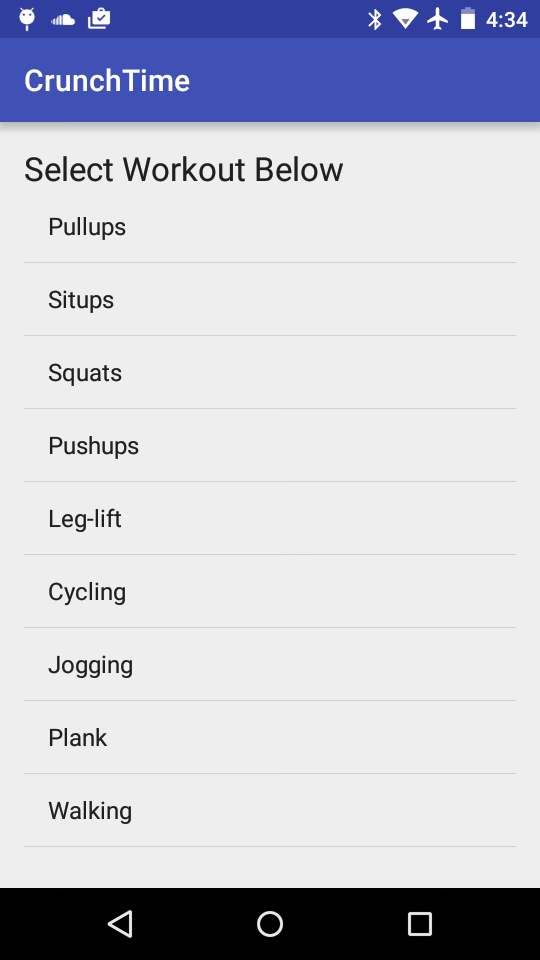
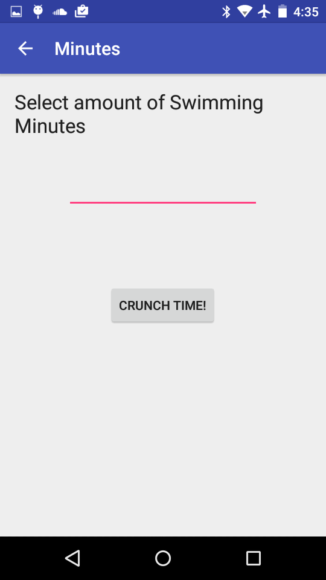
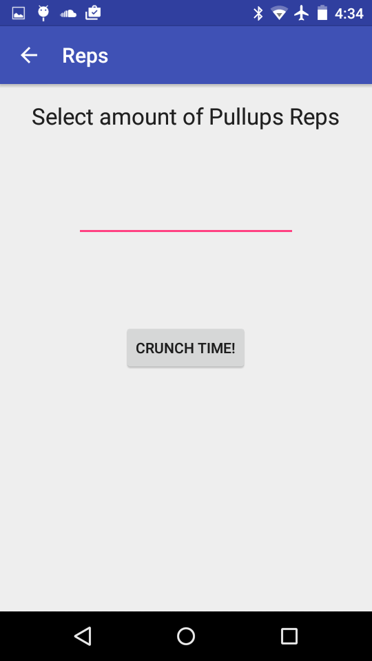
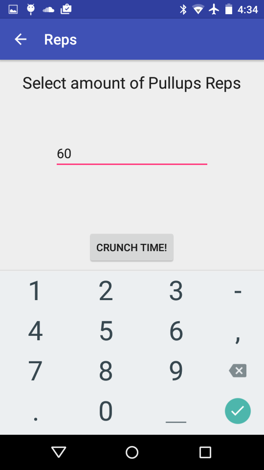
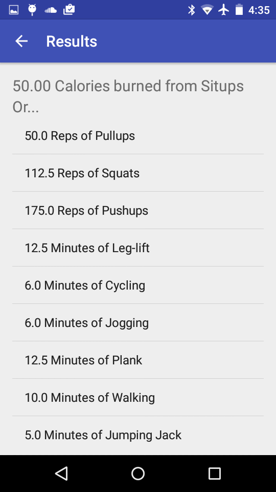

# PROG 01: Crunch Time

Crunch Time allows users to both recieve calorie information on their workouts
and compare different exercises.

## Authors

Ko Costarella ([ko.costarella@berkeley.edu](mailto:ko.costarella@berkeley.edu))

## Demo Video

See [Crunch Time Video, Password: cs160] ( https://vimeo.com/154378849)

## Screenshots

